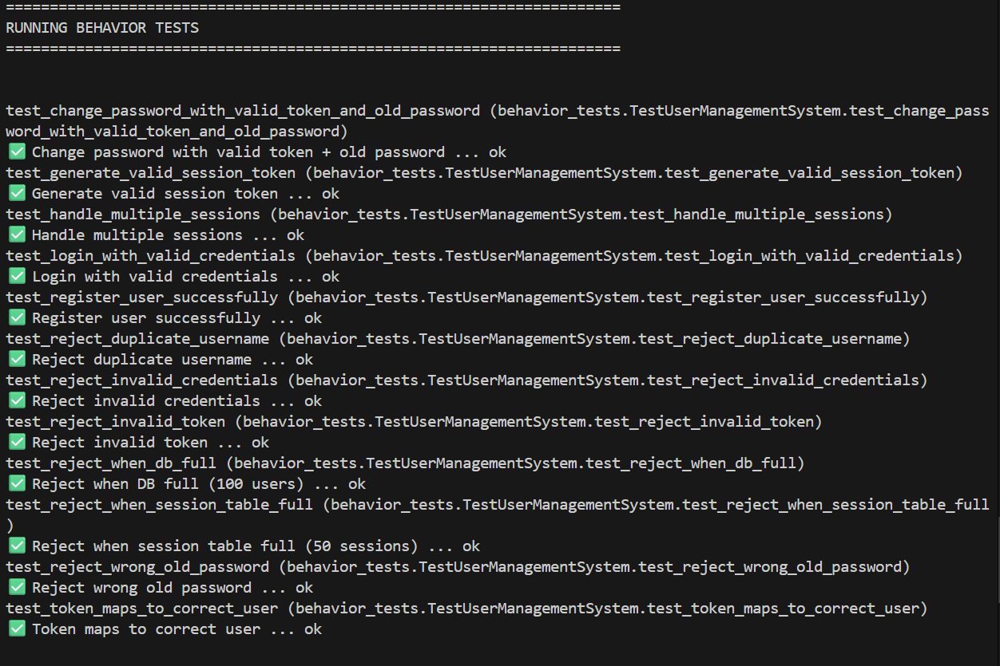

# Claude Code Usage

## Setup
- **COBOL Knowledge Before Starting:** None
- **Time spent:** 3 hours
- **Approach:** Supervised (iterative prompting with Claude Code)

## What I Did

### Step 1: Understanding the Legacy COBOL Code
I had zero COBOL knowledge, so I started by asking Claude Code to explain what the program does.

**Prompts used:**
- "Explain what this COBOL Program does in simple terms?"
- "What are the edge cases in this COBOL code?"
- "Are we checking whether user is Active or not when password change request is coming?"
- "What design pattern COBOL code is following and by converting it directly in python its not violating any issues?"

**What Claude Code did:**
- Explained the user management system (register/login/change password)
- Identified data structures (100 user array, 50 session array)
- Found edge cases.
- Explained the procedural design pattern and potential anti-patterns.

### Step 2: Creating the Python Implementation
I asked Claude Code to generate a Python class that replicates the exact COBOL behavior.

**Prompts used:**
- "Read legacy_app.cob and create a Python class that does exactly the same thing. Call it modern_app.py"

**Result:**
- Claude Code created `modern_app.py` with identical behavior on the first try
- Same logic flow, same error messages

### Step 3: Building the Test Suite
I asked Claude Code to create comprehensive tests to validate the Python implementation.

**Prompts used:**
- "We want to create a behavior_tests.py that test all these functionality" (with 12 specific test requirements)
- "Suggest me 1 change in each test, so that i can see error is occurred"

**Result:**
- Created `behavior_tests.py` with 12 unit tests
- All tests passed, validating behavior-identical migration

### Step 4: Creating Grading and Evaluation System
I asked Claude Code to build a grading system and test runner.

**Prompts used:**
- "Make a evaluate_refactor.py which is a grading system for our new python-based refactored code"
- "Now create run_evaluation.py which will run all test in terminal and show results"

**Result:**
- Created `evaluate_refactor.py` (60% behavior, 20% code quality, 20% legacy compatibility)
- Created `run_evaluation.py` (test runner with detailed output)

## What Worked
- **Code explanation:** Clear breakdown of COBOL syntax into plain English
- **Edge case identification:** : Proper edge cases were identified like if 101th user was added.
- **Python generation:** Working code on first attempt
- **Test suite creation:** Comprehensive 12-test coverage
- **Design pattern analysis:** Explained procedural pattern and anti-pattern concerns

## What Didn't Work
- **Verbosity:** Sometimes responses were overly detailed when concise answers were needed
- **Claude Code weaknesses identified:**
  - Doesn't always remember context from earlier in the conversation
  - Sometimes makes assumptions instead of asking clarifying questions
  - May revert changes or miss subtle requirements without explicit prompts

## Key Commands

```bash
# View COBOL code
cat legacy_app.cob

# Run the Python implementation
python modern_app.py

# Run all behavior tests
python behavior_tests.py

# Run tests with detailed output
python run_evaluation.py

# Run grading system
python evaluate_refactor.py
```

## Results

**Test Results:**
- **12/12 behavior tests passed**
- All functionality validated

**Grading Results:**
- **Total Score: 100/100**
- **Grade: A (Excellent)**
- Behavior Tests: 60/60
- Code Quality: 20/20
- Legacy Compatibility: 20/20

## Proofs
